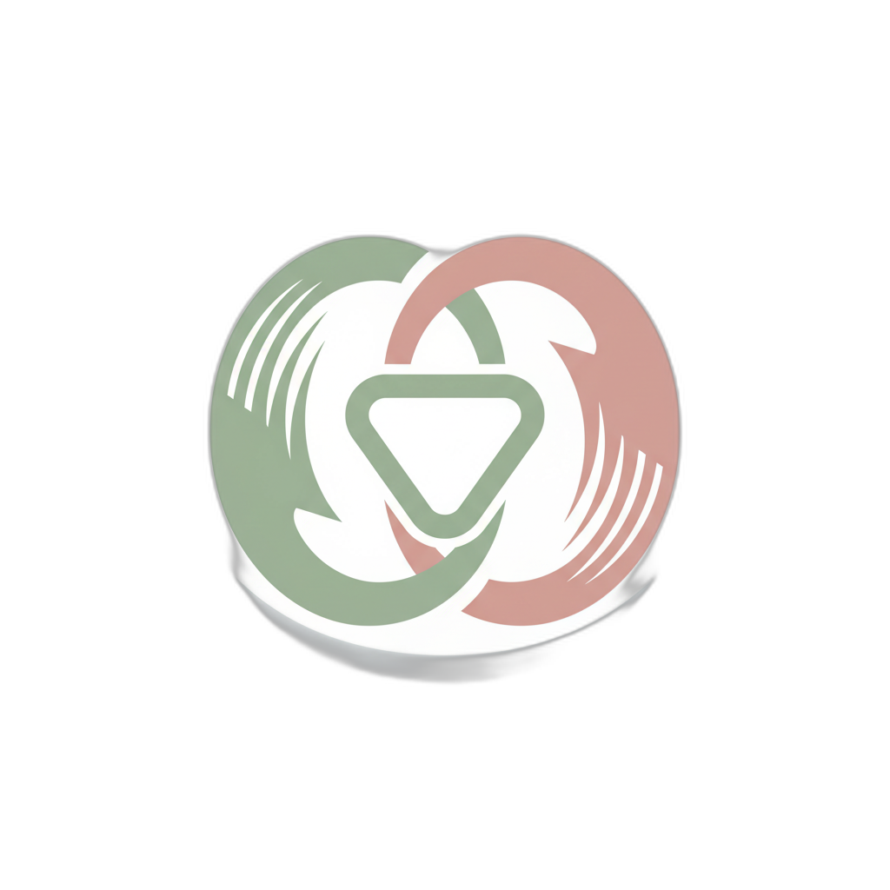

<div align="center">
  
  <h1>Bloom — Built Around Your Cycle</h1>
  <p>Hormone-adapted exercise programming and nutrition. Train with your cycle, not against it — strength, timing, and soulful Indian nourishment.</p>
</div>

---

## 📖 About The Project

Bloom is a Next.js web application designed to help users track and adapt their fitness and nutrition according to their menstrual cycle. By providing personalized insights, hormone-adapted workout routines, and soulful Indian nutritional guidance, Bloom ensures that you're working *with* your body to achieve optimal health and balance.

## ✨ Key Features

- **Cycle-Synced Dashboard**: A centralized view of your current cycle phase, upcoming activities, and daily insights.
- **Hormone-Adapted Workouts**: Exercise routines tailored to your energy levels and physiological state during different phases of your cycle.
- **Nutritional Guidance**: Meal recommendations focusing on soulful Indian nourishment that support hormonal balance.
- **Progress Tracking**: Visualize your fitness journey and cycle patterns over time using beautiful, interactive charts.
- **Secure Authentication**: Safe and reliable user login and data protection.

## 🛠️ Tech Stack

- **Framework**: [Next.js 15](https://nextjs.org/) (App Router)
- **Library**: [React 19](https://react.dev/)
- **Language**: [TypeScript](https://www.typescriptlang.org/)
- **Styling**: [Tailwind CSS](https://tailwindcss.com/)
- **Authentication**: [NextAuth.js](https://next-auth.js.org/)
- **Data Visualization**: [Recharts](https://recharts.org/)

## 📂 Project Structure

```text
bloom/
├── public/                 # Static assets (images, icons, etc.)
└── src/
    ├── app/                # Next.js App Router pages and layouts
    │   ├── api/            # API Routes
    │   ├── dashboard/      # User Dashboard
    │   ├── home/           # Landing Page / Home View
    │   ├── insights/       # Data and analytics views
    │   ├── login/          # Authentication pages
    │   ├── meals/          # Nutrition and recipe pages
    │   ├── onboarding/     # Initial user setup flows
    │   ├── progress/       # User tracking and progress
    │   └── workout/        # Exercise routines
    ├── components/         # Reusable React components
    │   ├── providers/      # Context and State Providers
    │   └── ui/             # Generic UI components
    └── styles/             # Global CSS and Tailwind configurations
```

## 🚀 Getting Started

To get a local copy up and running, follow these simple steps.

### Prerequisites

Ensure you have Node.js and npm (or pnpm/yarn/bun) installed on your local machine.

### Installation

1. **Clone the repository** (if applicable) or navigate to the project directory:
   ```bash
   cd bloom
   ```

2. **Install dependencies**:
   ```bash
   npm install
   ```

3. **Start the development server**:
   ```bash
   npm run dev
   ```

4. **Open the application**:
   Open [http://localhost:4028](http://localhost:4028) in your browser to see the result.

## 📜 Available Scripts

In the project directory, you can run:

- `npm run dev`: Runs the app in development mode on port 4028.
- `npm run build`: Builds the app for production.
- `npm start`: Starts the production server.
- `npm run lint`: Runs ESLint to catch and fix potential issues.
- `npm run format`: Formats code using Prettier.
- `npm run type-check`: Checks for TypeScript errors without emitting files.
